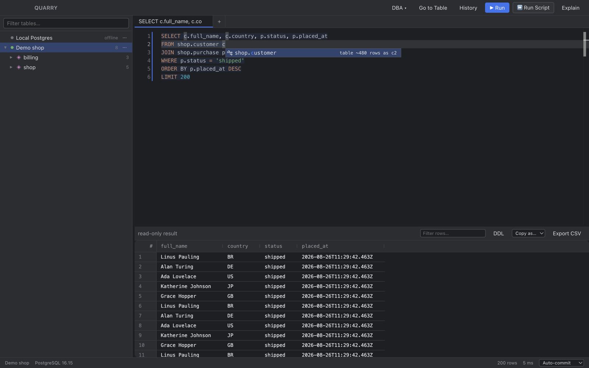

# Quarry

A DataGrip-style Postgres client for the desktop. Schema-aware completion, an
editable result grid with real transaction control, and a DBA cockpit — in a
small Electron app with no native dependencies.



## Install

Download a build from [Releases](https://github.com/lashaws/quarry/releases), or
build it yourself:

```bash
npm install
npm run package      # -> release/Quarry-<version>-<arch>.dmg
```

Builds are **unsigned**, so macOS Gatekeeper will refuse the first launch.
Right-click the app and choose *Open*, or:

```bash
xattr -dr com.apple.quarantine /Applications/Quarry.app
```

## What it does

**Editor**

- Context-aware completion for schemas, tables, columns and aliases, triggered
  as you type and after `.`
- The statement `⌘⏎` will run is highlighted, so what executes is never a guess
- Accepting a table in a `FROM`/`JOIN` appends a generated alias
  (`order_line` → `ap`, deduped against aliases already in scope)
- `JOIN … ON` conditions pre-filled from foreign keys, in either direction
- Hover a table for its columns with PK/FK marks and comments; hover a column for
  type, nullability, default, FK target and indexes
- `⌘B` opens the table under the caret; `⌘⇧X` expands `*` to the column list

**Results**

- Editable grid — but only when the result maps to one table with a resolvable
  primary key, so a join stays read-only
- Insert, update and delete rows; every change stages as a visible SQL preview
  and submits in one transaction
- Auto-commit or manual commit with explicit Commit/Rollback; closing with an
  open transaction asks first
- Filter box, `Copy as` CSV/JSON/INSERT, streamed CSV export, regenerated
  `CREATE TABLE` per table

**Running SQL**

- `⌘⇧⏎` runs the whole console; each statement gets its own result tab
- `RAISE NOTICE` output, affected-row counts and `RETURNING` rows all surface
- DDL refreshes the catalog automatically
- Query plans as a tree, scaled by self time

**DBA cockpit**

Eleven diagnostics: active sessions, blocking chains, held locks, index usage,
unused and duplicate indexes, table sizes, dead tuples, measured bloat, cache hit
ratios, vacuum health, and slowest statements. They run through the ordinary
query path, so each lands in the normal grid with sorting, filtering and export
already working.

## Keybindings

| | |
|---|---|
| `⌘⏎` | Execute the statement under the caret |
| `⌘⇧⏎` | Execute the whole script |
| `⌘⎋` | Cancel running statement |
| `⌘⌥⏎` / `⌘⌥Z` | Commit / Rollback |
| `⌘⇧P` / `⌘⌥⇧P` | Explain / Explain Analyze |
| `⌘B` | Go to the table under the caret |
| `⌘⇧X` | Expand `*` to the column list |
| `⌘⌥L` | Format |
| `⌘O` / `⌘⌃E` | Go to table / query history |
| `⌘⌥N` / `⌘⌥⌫` / `⌘⌥0` | Add row / delete row / set NULL |
| `⌘⇧D` | Show DDL |
| `⌘R` | Refresh catalog |
| `⌘N` / `⌘W` / `⌘⇧E` | New console / close / export CSV |

## Development

```bash
npm run dev          # run it
npm run build        # typecheck + production build
npm run test         # unit tests, no database needed
npm run test:all     # unit + live + session
```

The live suites need a Postgres. They build their own fixture schema and drop it
afterwards, so any database will do:

```bash
docker run -d --name quarry-pg -e POSTGRES_PASSWORD=quarry -e POSTGRES_USER=quarry \
  -e POSTGRES_DB=quarrytest -p 55432:5432 postgres:16-alpine

PGHOST=localhost PGPORT=55432 PGDATABASE=quarrytest PGUSER=quarry PGPASSWORD=quarry \
  npm run test:all
```

In dev the app exposes a CDP endpoint on 9222;
`node test/probe/drive.mjs '[["label","<js>"]]'` evaluates JavaScript inside the
running window, and `node test/probe/drive.mjs shot:out.png` screenshots it. That
is how the UI behaviour is checked end to end.

## Architecture

Electron with a hard process split — the renderer never touches Node or a
database.

```
main process (Node 24)                 renderer (React 19 + Vite)
├── drivers        pg
├── introspect     catalog snapshot
├── query          runner · dml · editable · ddl · plan
├── dba            curated diagnostics
├── history        node:sqlite
└── secrets        Electron safeStorage
        │
        └── typed IPC (contextIsolation on) ──▶ UI, Monaco, AG Grid
```

**Zero native modules.** Electron 44 bundles Node 24 with `node:sqlite` built in,
which covers the query-history store, and `pg` is pure JS. No rebuild step, no
ABI mismatches. Passwords use Electron's `safeStorage` rather than `keytar`.

## Notes from building it

Five things were non-obvious enough to be worth writing down. Each was a real
bug, most of them found by adversarial review rather than by testing.

**Editability must reject self-joins.** Postgres reports the *same* relation oid
for every alias of one table, so `SELECT a.*, b.x FROM t a JOIN t b` passes a
single-source-table check — and an `UPDATE` keyed on one alias's primary key then
writes to the wrong row. `resolveEditTarget` also requires exactly one table
reference and refuses a result where two columns map to the same source column.
The comma form `FROM t a, t b` is why the table scanner is a scanner and not a
regex.

**An open cursor owns the connection.** A suspended result cursor holds the
protocol state, so any other statement queues behind something that never
finishes — a permanent hang with no timeout, on any result over 500 rows.
`run()` closes the open cursor before letting another statement through, and
every query goes through it.

**`EXPLAIN ANALYZE` executes the statement.** Explaining a DML statement through
a non-transactional path makes the write durable in manual-commit mode, with
nothing left to roll back.

**Plan self-time has three traps.** `Actual Total Time` is per-loop and cumulative
over children; under a `Gather` it is CPU summed across workers rather than
elapsed; and a materialised CTE is timed once in its InitPlan and again in every
`CTE Scan`. Get any of them wrong and the viewer points at the wrong node, which
is its only job.

**Our CSS shares a document with Monaco and AG Grid.** Their widgets render inside
our tree, so an unscoped rule on a generic class name silently restyles them. A
global `.main { flex-direction: column }` hijacked the suggest widget's row
layout and pushed every completion label out of its 20px row — autocomplete
looked broken while the engine returned correct results. Every app class is
namespaced `q-*`, and a test fails the build if that ever regresses.

## Not built yet

SQLite and DuckDB drivers (the IPC contract already allows for them), SSH
tunnels, schema diff, ER diagrams, and a Windows/Linux release pipeline.

## License

MIT — see [LICENSE](LICENSE).
